Overview
========

The code in SunSky.* is an implementation of several sky models:

* The Preetham Clear Sky model. (From ["A Practical Analytic Model for
  Daylight"](https://www.cs.utah.edu/~shirley/papers/sunsky/), Preetham, Shirley
  & Smits.)

* The Hosek Clear Sky model. (From ["An Analytic Model for Full Spectral Sky-Dome
  Radiance"](https://cgg.mff.cuni.cz/projects/SkylightModelling/), Hosek &
  Wilkie.)

* Various luminance-only CIE models:
  * The Clear Sky model
  * The Overcast Sky model
  * The Partly(!) Cloudy Sky model
  * The more recent fifteen CIE sky models from, e.g., "CIE general sky standard
    defining luminance distributions", Darula & Kittler. (There are many variants
    of this paper!)

* The sun model from Preetham (also used by Hosek), and helpers for converting
  from time and place to local sun direction.

In addition, for the Preetham and Hosek models, I have added:

* Table-driven versions for fast evaluation on the GPU (or indeed CPU) via
  64 x 2 lookup table.

* Extended table-driven versions that use zonal harmonics to produce approximate
  mirror-to-diffuse BRDF power convolutions. These use 64 x 8 or 64 x 16
  tables.

* Proper handling of night transitions. The original models assume the sun
  is above the horizon. The supplied code transitions to a dark blue sky as
  the sun fully sets, and then to black towards the end of twilight.

* An extension to allow mixing the clear sky models with an overcast sky
  via a simple linear 'overcast' factor. Generally it's best to use this
  to simulate high cloud, while low-lying clouds are represented explicitly
  in the shader. However, when used for shading rather than skybox display,
  it can also represent low-lying cloud cover.

The Preetham code is a trusty standby, and has been shipped in several games.

The Hosek code is new, it is a re-implementation of the Hosek paper using
floats, with some minor optimisations, and an attempt to make the structure a
bit more obvious. The CPU-only and table variants are solid, as is the night
transition. The overcast functionality and BRDF convolution might need a bit
more tweaking.

I would like to provide some sample shaders, but for now look at FillTexture*,
and the Table::SkyRGB() routines.

Results
=======

Preetham
--------

Clear Sky:

Overcast 50%/Day

 

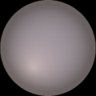

BRDF Day/Sunset:

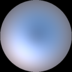

 
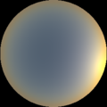

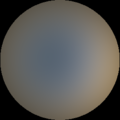

Hosek
-----

Clear Sky:

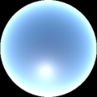
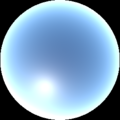

Overcast 50%/Day:

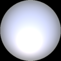
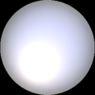
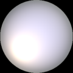
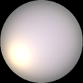

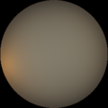

 
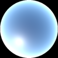
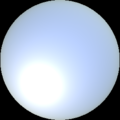

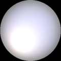

BRDF Day/Sunset:

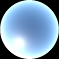

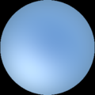
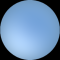

 
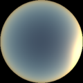

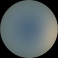

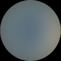
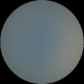

SunSky Tool
===========

Included in SunSkyTool.cpp is a tool exercising most of the sky model
functionality. Current options are below. It can be used to generate top-down
'hemisphere' views with or without fisheye projection, panoramic views, and
cube maps, with various forms of tonemapping. Both LDR (png) and HDR (pfm)
versions are output.

Building
--------

To build this tool, use

    c++ --std=c++11 -O3 SunSky.cpp SunSkyTool.cpp -o sunsky

Or add those files to your favourite IDE.

Options
-------

        sunsky <options>

        Options:
          -h : this help
          -t <time>          : 0 - 24
          -d <day of year>   : 0 - 365
          -b <tubidity>      : 2 - 30
          -x <ground_bounce> : 0 - 1
          -l <latitude> <longitude>
          -w <normalisation weight>
          -g <gamma>
          -e <tonemapType> : use given tonemap operator (default: linear)
          -a : autoscale intensity
          -i : invert hemisphere
          -f : fisheye rather than cos projection
          -c : output cubemap instead
          -p : output panorama instead
          -m : output movie, record day as sky.mp4, requires ffmpeg
          -v : verbose
          -s <skyType> : use given sky type
          -r <roughness:float> : specify roughness for PreethamBRDF

        skyType:
          Preetham         (pt)
          PreethamTable    (ptt)
          PreethamBRDF     (ptb)
          Hosek            (hk)
          HosekTable       (hkt)
          HosekBRDF        (hkb)
          cieClear         (cc)
          cieOvercast      (co)
          ciePartlyCloudy  (cp)

        toneMapType:
          linear           (l)
          exponential      (ex)
          reinhard         (rh)

Examples
--------

Show noon sky for the current time of year using Preetham:

        sunsky -t 12

Glossy version of the same sky:

        sunsky -t 12 -s preethamBRDF -r 0.3

Hosek sky at 4pm with greenish albedo, high turbidity, and exponential tone
mapping, saved to a cube map:

        sunsky -t 16 -s hosek -x 0.2 0.5 0.2 -b 6 -e ex -c

